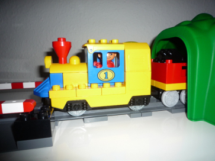
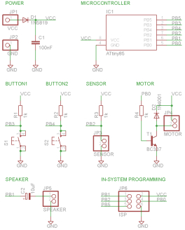
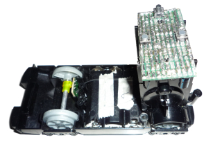
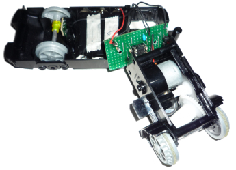

## duplo-train :steam_locomotive:

I decided to post an old project (from 2009) of mine which I made for my kids (and of cause to learn :).

The project is a PCB prototype for a LEGO DUPLO train which uses a 8-bit [ATtiny85](https://www.microchip.com/wwwproducts/en/ATtiny85) microcontroller (still available!) to control the motor, buttons, sensor and produce different train sounds.

The idea was to change the sound to sound a bit more like a steam train than a more modern diesel train. Why? Because it could be done :)

### Features

* Starts and stops slowly as an old steam train :steam_locomotive:
* Have realistic sounds (sound from a real steam train) when the train starts and stops :sound:
* When the train is running there is a sound from a bell and horn (again real steam train sounds) :mega:
* When the train is fuelled via the button the horn is heard
* The motor stops if it hits e.g. a wall :collision:
* If the train has not been used within 5 seconds it goes into a power save mode :zzz:

### Software

The code was written in [Atmed Studio](http://www.microchip.com/mplab/avr-support/atmel-studio-7) but also compiles with the older [CrossPack](https://www.obdev.at/products/crosspack/index.html) on Mac OS X.

### Schematics

### PCB prototype

Happy hacking! :)
